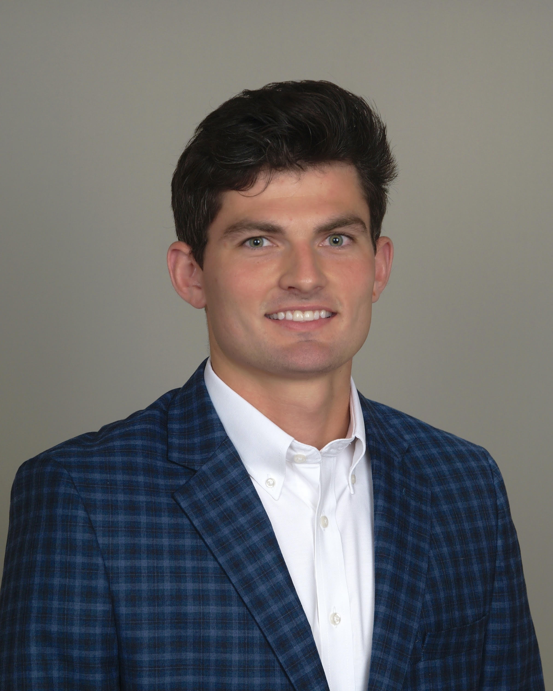

# About Me

I'm an Electrical and Computer Engineering Master's student specializing in Machine Learning Data Science at University of California San Diego. I'm interested in applications machine learning in areas such as computer vision, time series forecasting, quantitative finance and more! I will be graduating in March of 2022 and am looking for full time positions in Data Science and Software Engineering.  

Before Studying at UCSD, I studied Computer Engineering at Michigan State University, and later worked as a software integration engineer at General Motors where I worked on l2 and L2+ autonomous vehicles.

# Graduate Coursework

### Probability, Statistics, Mathematics
- [Probability and Statistics for Data Science](https://catalog.ucsd.edu/courses/ECE.html#ece225a)
- [Random Processes](https://catalog.ucsd.edu/courses/ECE.html#ece250)
- [Linear Algebra and Applications](https://catalog.ucsd.edu/courses/ECE.html#ece269)

### Machine Learning
- [Statistical Learning I](http://www.svcl.ucsd.edu/courses/ece271A/ece271A.htm)
- [Statistical Learning II](http://www.svcl.ucsd.edu/courses/ece271B-F09/)
- [Machine Learning for Physical Appplications](https://catalog.ucsd.edu/courses/ECE.html#ece228)
- [Intro to Deep Learning and Applications](https://xiaolonw.github.io/ece176/schedule.html)
- [Machine Learning Algorithims](https://cse.ucsd.edu/graduate/courses/course-descriptions/cse250b-principles-artificial-intelligence-learning-algorithms)
- [Web Mining and Recommender Systems](https://cseweb.ucsd.edu/classes/fa21/cse258-b/)

### General/Electives 
- Programming for Data Analysis 
- Computational Data Analysis and Product Development 
- Search and Optimization
- [Introduction to Mathematical Finance]()

# Projects 
### [Mus-X](https://github.com/jboboyle/ECE229) - A Dashboard for Personalized Music Recommendation and Self Discovery
### SGL-DANN - Domain Adaptation using Small Group Learning Framework
### Deep Embedded Clustering of Antarctic Seismic Data

# Work Experience

### ScriptChain Health: Machine Learning Intern
- Developed a cardiovascular disease prediction model using Graph Neural Networks to assist in early disease 
detection and prevention
- Obtained skills in data processing, model reseach and deep neural net design 
### General Motors: Software Integration Engineer
- Analyzed ECU communication signals and CAN traffic to diagnose issues in level 3 autonomous vehicles
- Designed software testing/validation procedures for rollover, side, and front collisions in development vehicles
### General Motors: Electrical Engineering Intern
- Wrote software for a water flow monitoring system expected to save 750k in manufacturing losses per year
- Designed and implemented software changes to resolve recurring issues between plant employees and machine interfaces
- Performed electrical and software maintenance to troubleshoot downed robotics and casting machines 

# Contact 
- email: jboboyle at ucsd dot edu - *preferred*
- [Linkedin](https://www.linkedin.com/in/jack-o-boyle-209b28170/) 

